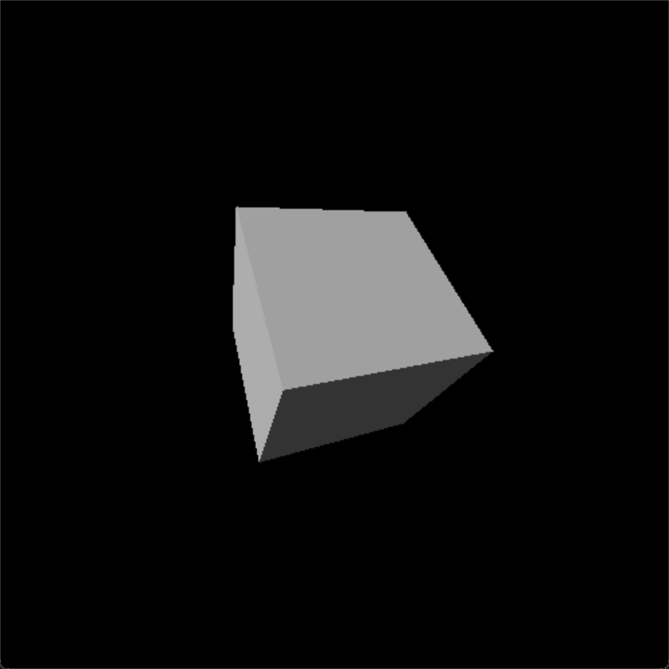
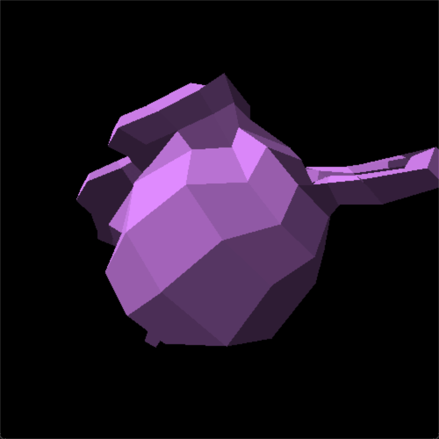

# Renderer

[](https://forthebadge.com)
[](https://forthebadge.com)

A *very slow imperfect* object renderer using only pygame's 2D functionality.




This served as my Computer Science 30 (Grade 12) final project. We were tasked with making a substantial project that demonstrated the use of Object Oriented Programming (OOP).

## Quick Start

Just copy and paste into your terminal, select an object, and you will see it.

```
git clone 
```

*This guide assumes that you have git, python3, and pip installed properly.*